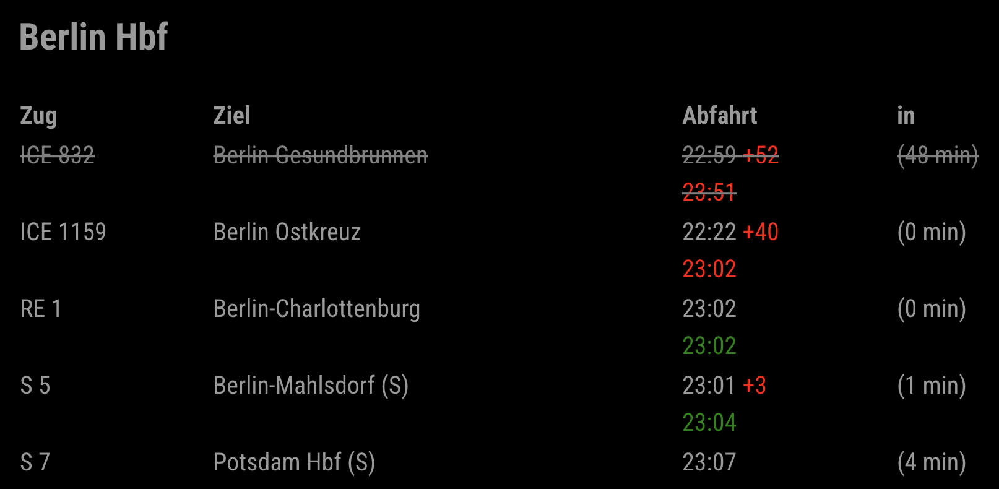

## MMM-DBF-Navigator

A MagicMirror² module to display live train departures from Deutsche Bahn at your chosen station.

---

### Features

- Shows upcoming train departures from a configurable station
- Displays train name, destination, scheduled and real departure time, delay, and time remaining
- Highlights cancelled trains
- Supports filtering via a specific station
- Multilingual support (English, German)

---

## Installation

1. **Navigate to your MagicMirror modules folder:**
   ```sh
   cd ~/MagicMirror/modules
   ```

2. **Clone this repository:**
   ```sh
   git clone https://github.com/Pascal-nie/MMM-DBF-Navigator.git
   ```

---

## Configuration

Add the module to your `config.js` in the MagicMirror `modules` array:

```javascript
{
  module: "MMM-DBF-Navigator",
  position: "top_left", // Or any region you prefer
  config: {
    from: "Berlin Hbf", // Departure station
    maxSize: 8,         // Maximum number of departures to show
    via: ""             // (Optional) Filter via a specific station
  }
}
```

### Config Options

- **from**  
  _Type:_ `string`  
  _Description:_ The departure station name. Check  for correct station name.
  _Default:_ `"Berlin Hbf"`  
  _Example:_  
  ```javascript
  from: "Munich Hbf"
  ```

- **maxSize**  
  _Type:_ `number`  
  _Description:_ Maximum number of departures to display.  
  _Default:_ `8`  
  _Example:_  
  ```javascript
  maxSize: 5
  ```

- **via**  
  _Type:_ `string`  
  _Description:_ (Optional) Filter departures via a specific station. Leave empty for all.  
  _Default:_ `''`  
  _Example:_  
  ```javascript
  via: "Leipzig"
  ```

---

## Example Configuration

```javascript
{
  module: "MMM-DBF-Navigator",
  position: "top_left",
  config: {
    from: "Frankfurt Hbf",
    maxSize: 10,
    via: "Wiesbaden"
  }
}
```

---

## Screenshots



---

## Troubleshooting

- Make sure your MagicMirror is running and the module is listed in your `config.js`.
- If you see no data, check your internet connection and station spelling.
- For issues, open a [GitHub Issue](https://github.com/YOUR_GITHUB/MMM-DBF-Navigator/issues).

---

## Contributing

Pull requests and suggestions are welcome! Please ensure your changes are well documented.

---

## License

MIT

---

## Credits

Inspired by the MagicMirror² community and Deutsche Bahn API.
