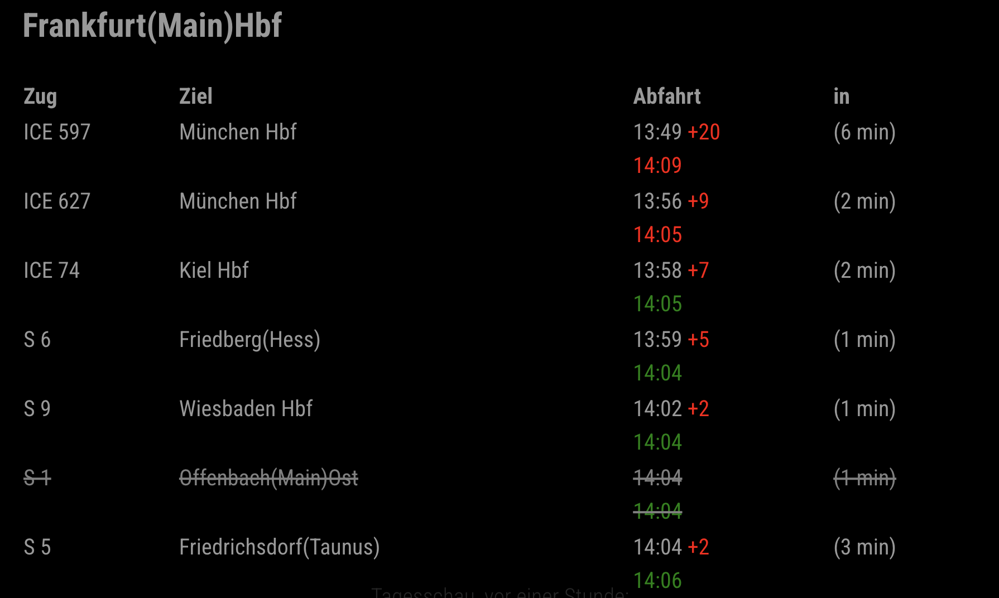

## MMM-DBF-Navigator

A MagicMirror² module to display live train departures from Deutsche Bahn at your chosen station(s).

---

### Features

- Shows upcoming train departures from one or multiple configurable stations
- Displays train name, destination, scheduled and real departure time, delay, and time remaining
- Highlights cancelled trains
- Supports filtering via a specific station
- Multilingual support (English, German)
- Configurable update interval

---

## Installation

1. **Navigate to your MagicMirror modules folder:**
   ```sh
   cd ~/MagicMirror/modules
   ```

2. **Clone this repository:**
   ```sh
   git clone https://github.com/YOUR_GITHUB/MMM-DBF-Navigator.git
   ```

3. **Install dependencies (if any):**
   This module does not require additional dependencies by default.

---

## Configuration

Add the module to your `config.js` in the MagicMirror `modules` array:

```javascript
{
  module: "MMM-DBF-Navigator",
  position: "top_left", // Or any region you prefer
  config: {
    from: "Berlin Hbf", // Departure station
    via: "",            // (Optional) Filter via a specific station
    maxSize: 8,         // (Optional) Maximum number of departures to show
    updateInterval: 10000, // (Optional) Update interval in milliseconds (default: 10 seconds)
    stations: []        // (Optional) Array of station objects for multi-station support
  }
}
```

### Config Options

- **from**  
  _Type:_ `string`  
  _Description:_ The departure station name.  
  _Default:_ `"Berlin Hbf"`  
  _Example:_  
  ```javascript
  from: "München Hbf"
  ```

- **via**  
  _Type:_ `string`  
  _Description:_ (Optional) Filter departures via a specific station. Leave empty for all.  
  _Default:_ `''`  
  _Example:_  
  ```javascript
  via: "Leipzig"
  ```

- **maxSize**  
  _Type:_ `number`  
  _Description:_ (Optional) Maximum number of departures to display.  
  _Default:_ `8`  
  _Example:_  
  ```javascript
  maxSize: 5
  ```

- **updateInterval**  
  _Type:_ `number`  
  _Description:_ (Optional) How often to update the departures, in milliseconds.  
  _Default:_ `10000` (10 seconds)  
  _Example:_  
  ```javascript
  updateInterval: 30000 // 30 seconds
  ```

- **stations**  
  _Type:_ `array`  
  _Description:_ (Optional) List of station objects for displaying departures from multiple stations. Each object should have at least a `from` property, and optionally a `via` property.  
  _Default:_ `[]`  
  _Example:_  
  ```javascript
  stations: [
    { from: "Berlin Hbf", via: "Leipzig Hbf" },
    { from: "München Hbf", via: "Nürnberg Hbf" }
  ]
  ```

---

## Example Configuration

```javascript
{
  module: "MMM-DBF-Navigator",
  position: "top_left",
  config: {
    // Single station example
    from: "Frankfurt Hbf",
    via: "Wiesbaden",
    maxSize: 10,
    updateInterval: 30000 // updates every 30 seconds

    // OR for multiple stations:
    // stations: [
    //   { from: "Berlin Hbf", via: "Leipzig Hbf" },
    //   { from: "München Hbf", via: "Nürnberg Hbf" }
    // ]
  }
}
```

---

## Screenshots



---

## Troubleshooting

- Make sure your MagicMirror is running and the module is listed in your `config.js`.
- If you see no data, check your internet connection and station spelling.
- For issues, open a [GitHub Issue](https://github.com/YOUR_GITHUB/MMM-DBF-Navigator/issues).

---

## Contributing

Pull requests and suggestions are welcome! Please ensure your changes are well documented.

---

## License

MIT

---

## Credits

Inspired by the MagicMirror² community and Deutsche Bahn API.
